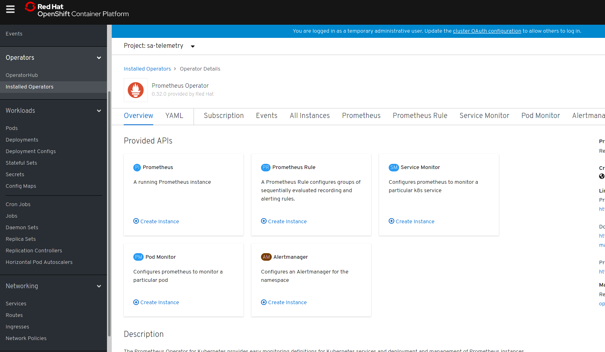
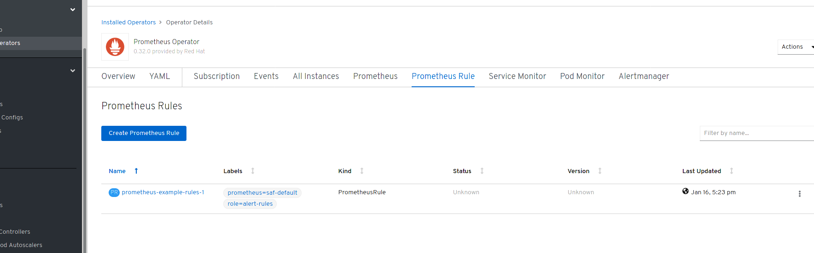
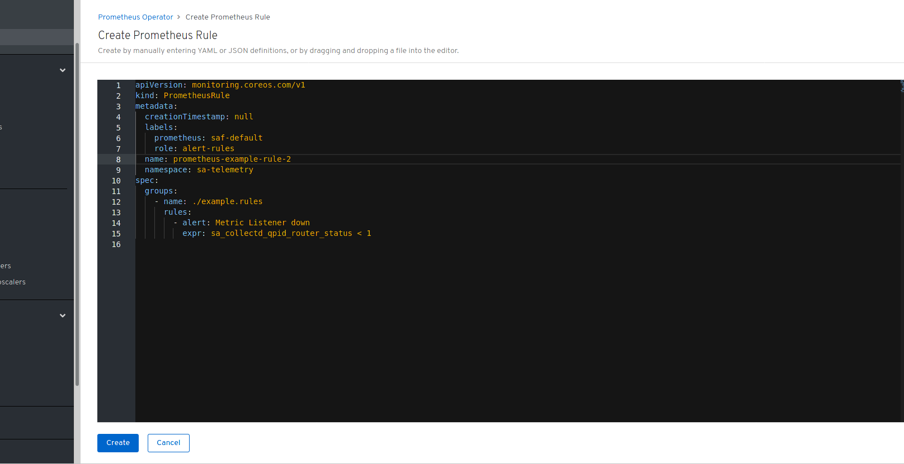
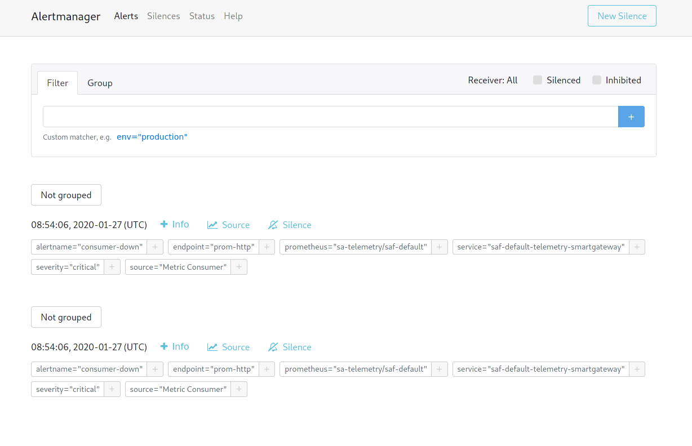

// Module included in the following assemblies:
//
// <List assemblies here, each on a new line>
// This module can be included from assemblies using the following include statement:
// include::<path>/con_architecture.adoc[leveloffset=+1]

// The file name and the ID are based on the module title. For example:
// * file name: con_my-concept-module-a.adoc
// * ID: [id='con_my-concept-module-a_{context}']
// * Title: = My concept module A
//
// The ID is used as an anchor for linking to the module. Avoid changing
// it after the module has been published to ensure existing links are not
// broken.
//
// The `context` attribute enables module reuse. Every module's ID includes
// {context}, which ensures that the module has a unique ID even if it is
// reused multiple times in a guide.
//
// In the title, include nouns that are used in the body text. This helps
// readers and search engines find information quickly.
// Do not start the title with a verb. See also _Wording of headings_
// in _The IBM Style Guide_.

= Creating an alert

For alerting, two components are involved: First of all, Prometheus
executes rules. They can be found in Prometheus web UI under
Status/Rules. These rules are evaluated, and if the expression is true,
an alert will be fired. Alerts itself are also shown under the
Alerts tab in the web UI.

Alertmanager is the component to deliver alerts to an external system,
for example via email, IRC, or other notification channels.

As example, one could create a notification rule via OpenShift:

[source,yaml]
----
apiVersion: monitoring.coreos.com/v1
kind: PrometheusRule
metadata:
  creationTimestamp: null
  labels:
    prometheus: saf-default
    role: alert-rules
  name: prometheus-example-rule-1
  namespace: sa-telemetry
spec:
  groups:
    - name: ./example.rules
      rules:
        - alert: Metric Listener down
          expr: sa_collectd_qpid_router_status < 1
----

executing oc create -f <file name> will create a PrometheusRule object
named prometheus-example-rule-1, which will result in a rule in
Prometheus.

The same can also be achieved by navigating in the OpenShift web UI to
the Installed Operators menu item under Operators, then click on
Prometheus Operator followed by clicking on "Prometheus Rule" in
the sub-menu.

followed by clicking on "Create PrometheusRule" on

and finally filling in the empty spots in the next editor window

For more info in alerting, see link:https://github.com/coreos/prometheus-operator/blob/master/Documentation/user-guides/alerting.md

= Creating an alerting route in alertmanager

The alertmanager configuration is currently handled as a secret in OpenShift.
That makes it a bit complicated or uncomfortable to handle it. However,
the following section will roughly describe the necessary steps.

== Adding routes to alertmanager

Alertmanager comes with just a bare minumum of configuration shipped. After
default deployment, it looks like

[source,yaml]
----
          global:
            resolve_timeout: 5m
          route:
            group_by: ['job']
            group_wait: 30s
            group_interval: 5m
            repeat_interval: 12h
            receiver: 'null'
          receivers:
          - name: 'null'
----

As example, alertmanager can get configured by passing the following
template after deleting `oc delete secrect alertmanager-saf-default` via
oc create -f <filename>

[source,yaml]
----
apiVersion: v1
kind: Secret
metadata:
  name: alertmanager-saf-default
  namespace: sa-telemetry
type: Opaque
stringData:
  alertmanager.yaml: |-
    global:
      resolve_timeout: 5m
    route:
      group_by: ['job']
      group_wait: 30s
      group_interval: 5m
      repeat_interval: 12h
      receiver: 'webhook'

      routes:
      - match:
          severity: critical
        receiver: 'webhook-crit'
      - match_re:
          severity: !(critical)
        receiver: 'webhook'
    templates:
    - '*.tmpl'
    receivers:
    - name: 'webhook'
      webhook_configs:
      - url: http://192.168.36.9/webhook
    - name: 'webhook-crit'
      webhook_configs:
      - url: http://192.168.36.9/webhook-crit
----

Once this has been created, please restart alertmanager pod(s) by just killing
them; the prometheus operator will take care of restarting them.
